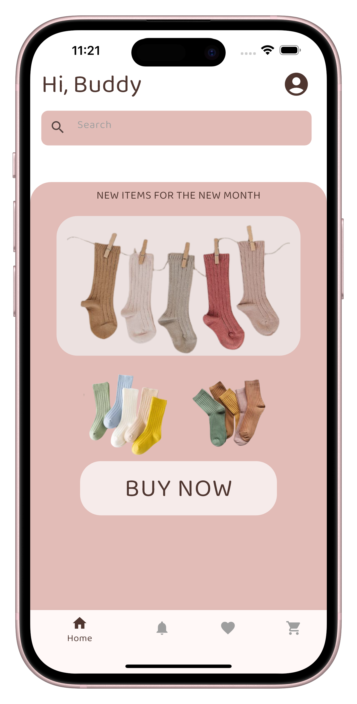

# 🧦 Socks Store




## 📑 Table of Contents
- [Overview](#overview)
- [Why Socks Store?](#why-socks-store)
- [Getting Started](#getting-started)
- [Prerequisites](#prerequisites)
- [Installation](#installation)
- [Usage](#usage)
- [Testing](#testing)

## 📖 Overview

Socks_Store is a Flutter mobile app designed exclusively for iOS and Android, created to showcase my development skills in Flutter. This project focuses on demonstrating various UI elements, buttons, and actions within a mobile e-commerce context without connecting to any backend service. It highlights my ability to build feature-rich, polished apps using Flutter, emphasizing mobile user experience and interface design.

## ❓ Why Socks Store?

As a developer focusing on mobile app development, starting with e-commerce apps is an excellent way to showcase my skills and strengthen my programming abilities. This project streamlines the creation of scalable, maintainable shopping apps for iOS and Android with a focus on code quality and platform-specific optimizations. The core features include:

- ⚙️ Platform-Specific Build Configurations: Custom build scripts ensure smooth deployment on iOS and Android.
- 🔌 Plugin & Resource Management: Automated plugin registration and resource handling streamline development.
- 🎨 UI Components & Navigation: Pre-built screens, custom navigation, and reusable widgets facilitate rapid UI development.
- 🛠 Code Quality & Standards: Static analysis and linting configurations promote consistent, maintainable code.
- 📦 Modular Architecture: Organized source code structure supports scalability and easy customization.

## 🚀 Getting Started

## ✅ Prerequisites

This project requires the following dependencies:

- Programming Language: **Dart**
- Package Manager: **Pub**

## 🛠 Installation

Build Socks_Store from the source and install dependencies:

Clone the repository:

```bash
git clone https://github.com/Sripathiyadav/Socks_Store
```

Navigate to the project directory:

```bash
cd Socks_Store
```

Install the dependencies:

Using pub:

```bash
pub get
```

## ▶️ Usage

Run the project with:

```bash
flutter run
```

## 🧪 Testing

Socks_store uses the Flutter test framework. Run the test suite with:

Using pub:

```bash
pub run test
```

## 📬 Contact

For questions or contributions, reach out via [LinkedIn](https://www.linkedin.com/in/sripathi-yadav/) or check the [GitHub repository](https://github.com/Sripathiyadav/Socks_Store).

Feel free to contact me if you have any project ideas, or if you would like an explanation of the source code.